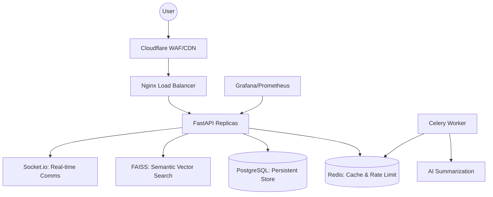

# 🚀 MentorNet: The Intelligent Academic Networking Platform


MentorNet is a production-hardened, AI-driven mentorship marketplace designed to connect students with elite mentors through high-fidelity semantic matching, real-time reputation ranking, and viral growth loops.

## 🏛️ Architectural Blueprint

Built for scale, security, and sub-second latency.



## ✨ Core Features

- **🧠 AI Semantic Discovery**: Deep-learning based mentor discovery using FAISS and Sentence Transformers.
- **📈 Reputation Ranking V2**: Real-time aggregated mentor scoring based on feedback volume and rating velocity.
- **🔁 Viral Referral Engine**: Automated referral loops with shareable public vanity profiles.
- **🔐 Fortress-Grade Security**: Dual-token JWT auth, Redis-backed blacklisting, and tiered rate-limiting.
- **📊 Full-Stack Observability**: Integrated Sentry (Errors), Prometheus (Metrics), and Grafana (Dashboards).

## 🛡️ Security & Privacy (GDPR Ready)

- **Stateful Auth**: Access + Refresh tokens with automatic rotation.
- **Kill Switch**: Immediate session invalidation via Redis blacklisting.
- **PII Protection**: Automated masking of sensitive data (emails, tokens) in logs.
- **Data Rights**: Built-in endpoints for secure Account Purging and Data Export.
- **Network Hardening**: Restrictive CORS, HSTS, and Content Security Policies.

## 🛠️ Technology Stack

- **Backend**: FastAPI (Python 3.14), SQLAlchemy 2.0
- **Database**: PostgreSQL 15, Redis 7
- **AI/ML**: FAISS, Sentence-Transformers
- **Frontend**: Next.js 14, TailwindCSS (Premium Design System)
- **Infrastructure**: Docker Compose, Nginx, GitHub Actions

## 🚀 Quick Start

Ensure you have [Docker](https://www.docker.com/) installed.

1. **Clone the repository:**
   ```bash
   git clone https://github.com/SahilKhutey/MentorNet.git
   cd MentorNet
   ```

2. **Configure Environment:**
   ```bash
   cp .env.example .env # Add your SENTRY_DSN here
   ```

3. **Ignition:**
   ```bash
   docker-compose up -d --build
   ```

4. **Verify:**
   - **API**: `http://localhost:8000/docs`
   - **Monitoring (Grafana)**: `http://localhost:3001`
   - **Task Status (Flower)**: `http://localhost:5555`

## 📊 Monitoring & Logs

MentorNet utilizes a structured JSON logging format ready for **Loki/ELK** ingestion.
- **Metrics**: Scraped every 15s by Prometheus.
- **Errors**: Captured instantly by Sentry.

---

Built with 💻 by [Sahil Khutey](https://github.com/SahilKhutey)
